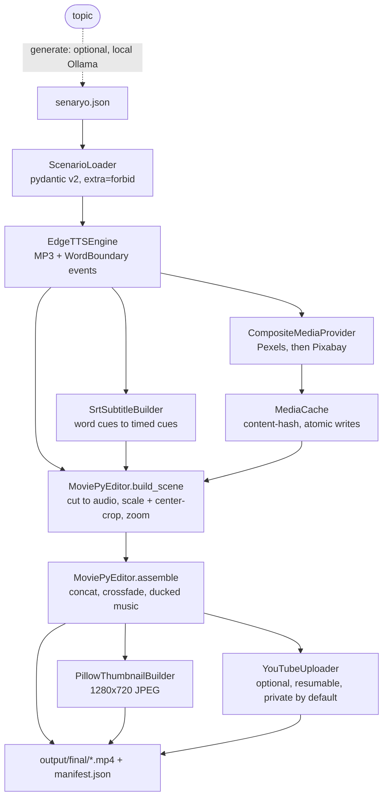

# youtube-automation

A fully local, zero-recurring-cost video production pipeline. You write a `senaryo.json`
describing your narration scene by scene; the pipeline synthesizes the voiceover, times the
subtitles to the spoken word, pulls matching stock footage, cuts everything to the length of the
audio, renders an H.264/AAC MP4 with burned-in captions, builds a thumbnail, and — only if you
ask it to — uploads the result to YouTube.

Nothing in the render path costs money and nothing calls an LLM at runtime. Narration comes from
Microsoft Edge's free `edge-tts` endpoint, footage from the free tiers of Pexels and Pixabay, and
encoding from the `ffmpeg` binary bundled with `imageio-ffmpeg`. The only paid-adjacent resource
is the YouTube Data API, which is free but quota-limited, and it is opt-in.

## Contents

- [How it works](#how-it-works)
- [Requirements](#requirements)
- [Quick start](#quick-start)
- [Generating scripts locally](#generating-scripts-locally)
- [Daily automation](#daily-automation)
- [Getting a Pexels API key](#getting-a-pexels-api-key)
- [Setting up YouTube uploads](#setting-up-youtube-uploads)
- [Scenario reference](#scenario-reference)
- [CLI reference](#cli-reference)
- [Output layout](#output-layout)
- [Caching and resumability](#caching-and-resumability)
- [Architecture notes](#architecture-notes)
- [Development](#development)
- [Troubleshooting](#troubleshooting)
- [Legal and policy](#legal-and-policy)

## How it works

The narration is the clock. Every other decision — how long a scene lasts, how many stock clips
it needs, when a subtitle appears — is derived from the synthesized audio rather than from
numbers you have to guess and keep in sync by hand.



The dashed edge is the only optional stage and the only one that touches a language model. It
runs as a separate command, writes a file, and stops; `run` never calls a model itself.

Two details are worth calling out because they drive most of the design:

**A single TTS pass yields both the audio and the subtitle timings.** `edge-tts` emits
`WordBoundary` events interleaved with the audio stream, so the pipeline reads the stream once
and gets word-level timestamps for free. Subtitles are therefore synchronized to the actual
speech rather than estimated from character counts.

**Scene duration comes from the measured audio length.** After synthesizing a scene's narration
the pipeline probes the MP3's real duration and cuts the stock footage to match, distributing the
time across however many clips the scene asked for. A scene is never too short for its own
voiceover.

## Requirements

- Python 3.10 or newer (developed and verified on 3.12.10)
- About 2 GB of free disk space for the virtual environment, caches and renders
- Internet access at runtime for TTS and stock footage — the render itself is local

`ffmpeg` does **not** need to be installed system-wide. `imageio-ffmpeg` ships a binary and the
pipeline uses it directly.

## Quick start

```bash
git clone <your-repo-url> youtube-automation
cd youtube-automation

python -m venv .venv
# Windows PowerShell
.venv\Scripts\Activate.ps1
# macOS / Linux
source .venv/bin/activate

pip install -r requirements.txt
cp .env.example .env          # then edit .env and add your Pexels key
python main.py doctor --fix   # checks the environment, downloads the default font
python main.py validate       # checks senaryo.json
python main.py run
```

`make install`, `make doctor`, `make run` and friends do the same thing if you have `make`.

Before your first real render, try `python main.py run --dry-run`. It resolves the whole plan and
prints what would happen without making a single network call, which is the fastest way to catch
a scenario mistake.

## Generating scripts locally

Writing `senaryo.json` by hand is the one genuinely manual step. If you would rather have a
first draft written for you, `generate` does that with a language model running on your own
machine through [Ollama](https://ollama.com) — free, offline after the initial download, and no
account or API key.

```powershell
# One-time setup
winget install Ollama.Ollama      # or download the installer from ollama.com
ollama pull qwen2.5:7b-instruct

python main.py generate "Yapay zekanın kısa tarihi" --scenes 12
```

That writes `senaryo.json`, which you then review and render with `run` as usual. Pass `--out` to
write somewhere else and `--overwrite` to replace an existing file.

### Why generation is a separate command

`generate` and `run` are deliberately not fused. The render path makes no language-model calls at
all, which means a bad or hallucinated draft can never reach the encoder: it lands in a JSON file
you can read, edit and validate first. It also means the guarantee that `run` is reproducible and
model-free still holds.

The division of labour matters too. The model is asked only for prose — narration, search terms,
title, tags. Every structural field is filled in by `modules/scenario_builder.py`: the project
slug, resolution, frame rate, codec settings, voice and subtitle styling are computed, not
generated. A small quantised model cannot corrupt them, and the assembled scenario is validated
against the real schema before it is written, so `generate` can never produce a file that `run`
would reject.

### What the generator cleans up

Local models are messy in predictable ways, so the output is sanitised rather than trusted.
Markdown, emoji, `Sahne 3:` prefixes and list bullets are stripped from narration; code fences
and chatty preambles are peeled off the JSON; search terms and tags are deduplicated and capped
to YouTube's limits; and an over-long title is truncated. If a reply is still unusable, the
generator re-prompts with the specific validation error, up to three attempts.

It also sets `max_duration_seconds` from the estimated narration length, so a generated scenario
never caps itself below its own runtime — a mistake that is easy to make by hand and only shows
up minutes into a render.

### Useful options

```powershell
python main.py generate "konu" -n 20                       # longer video
python main.py generate "konu" --orientation landscape     # 1920x1080 instead of Shorts
python main.py generate "konu" --language en               # narrate in English
python main.py generate "konu" --voice tr-TR-EmelNeural    # different voice
python main.py generate "konu" --model llama3.1:8b         # override OLLAMA_MODEL once
python main.py generate "konu" --guidance "skeptical tone, no hype"
python main.py generate "konu" --format story --language tr   # 15–20 min photo narrative
```

`--format story` writes a landscape scenario: twelve spoken chapters, twenty still photographs,
yellow/white captions. It does **not** render. Review the JSON, then `python main.py run`.
English and Spanish use the same flag: `--language en` or `--language es`. Shorts (`--format shorts`,
the default) is unchanged.

Story generation talks to Ollama once per chapter, so a first draft takes several minutes. The
render is longer than a Short: twenty Ken Burns stills under 15–20 minutes of narration. Daily
automation stays on Shorts until you set `VIDEO_FORMAT=story` in `.env`.

### Multi-brand agent packages

`brands/active.json` selects which YouTube channel skill the agent follows. Four brands ship in
this repo:

| Brand id | Channel | Scenario file | Topics queue |
|----------|---------|---------------|--------------|
| `badly-drawn-why` | Badly Drawn Why | `senaryo-paint.json` | `scenarios/topics-paint.json` |
| `after-hours-file` | After Hours File | `senaryo-file.json` | `scenarios/topics-file.json` |
| `drawn-anyway` | Drawn Anyway | `senaryo-drawn.json` | `scenarios/topics-drawn.json` |
| `every-level-pov` | Every Level POV | `senaryo-pov.json` | `scenarios/topics-pov.json` |

Paint-format brands (all except legacy Shorts) use agent-drawn stills in
`output/storyboard/<project_id>/`, then `python main.py run --scenario <file> --no-upload`.
Author scripts under `scripts/author_*.py` write the scenario JSON and a `beats.tsv` storyboard
manifest. Channel setup assets for Every Level POV live in `brands/assets/every-level-pov/`.

### Model choice

`qwen2.5:7b-instruct` is the default because it handles Turkish noticeably better than similarly
sized alternatives and reliably holds a JSON shape. A 7B model needs roughly 6 GB of RAM and runs
on CPU, just slowly — expect a minute or two for a dozen scenes. If generation is unreliable, a
larger instruct-tuned model helps far more than prompt tweaking; very small quantised models tend
to lose the JSON structure. `python main.py doctor` reports whether the server is up and the
configured model is actually pulled.

Uploading stays disabled in every generated file, and privacy stays `private`. Nothing publishes
until you read the narration and turn it on yourself.

## Daily automation

`generate` writes a file and stops. `daily` is the unattended loop: at most one video per
calendar day, inbox first, otherwise the next unused topic in `scenarios/topics.json`.

```powershell
# See what today would produce, without calling Ollama or rendering.
python main.py daily --dry-run

# Produce today's video. Upload stays off unless you opt in.
python main.py daily --yes

# Register a Windows task for 09:00. Missed days run when the PC is next on.
python main.py schedule --at 09:00
python main.py schedule --status
python main.py schedule --remove
```

`schedule` writes a Task Scheduler XML with **StartWhenAvailable**. If the machine was off at
09:00, Windows fires the task once when it comes back — and `daily` still produces only one
video, not one per missed day. That is deliberate: YouTube's default quota is about six uploads
per day, and rushing five scripts overnight is how you publish nonsense.

Priority on each invocation:

1. Already succeeded today → exit. `--force` overrides.
2. Oldest `scenarios/inbox/*.json` → render that, skip the model.
3. Next unused topic in `topics.json` → generate, then render.
4. Nothing left → idle, with a hint to add topics.

Failed generations do **not** consume the topic, so tomorrow retries the same subject. Used
topics are stored in `.cache/scheduler/state.json`, not in `topics.json`, so you can edit the
list without losing history.

Uploading is a separate opt-in. Generated files stay `private`. Either:

```powershell
python main.py daily --upload --yes
python main.py schedule --upload --at 09:00
```

or set `DAILY_UPLOAD=true` in `.env`. Before you turn that on, publish the Google Cloud OAuth
consent screen (Testing-mode refresh tokens die after seven days, which would silently stop
unattended uploads).

The PC must be on — or asleep with wake timers — at the scheduled time. Two overlapping runs
are refused by a lock file; a leftover lock older than six hours is treated as a crash and
stolen.

Edit `scenarios/topics.json` (copy from `topics.example.json`) before the first real `daily`.
Drop a hand-written `senaryo.json` into `scenarios/inbox/` whenever you want to skip the model
for a day.

## Getting a Pexels API key

Pexels is the primary footage source. The free tier allows 200 requests per hour and 20,000 per
month, which is far more than this pipeline needs — a typical three-minute video makes fewer than
ten search requests.

1. Create a free account at [pexels.com/join](https://www.pexels.com/join/).
2. Go to [pexels.com/api/new](https://www.pexels.com/api/new/) and request an API key. You will
   be asked what you are building; a one-line description is enough and approval is immediate.
3. Copy the key from your [API dashboard](https://www.pexels.com/api/key/).
4. Paste it into `.env`:

```dotenv
PEXELS_API_KEY=your_actual_key_here
```

Run `python main.py doctor` to confirm the key is picked up. The key is never logged: every
handler runs through a redaction filter that replaces registered secrets with `***REDACTED***`.

### Pixabay fallback (optional)

If a Pexels search comes back empty the pipeline can fall back to Pixabay. Get a key from
[pixabay.com/api/docs](https://pixabay.com/api/docs/) and set `PIXABAY_API_KEY` in `.env`. Leave
it blank to run Pexels-only; the fallback is simply skipped.

## Setting up YouTube uploads

Uploading is entirely optional. Skip this whole section if you only want rendered MP4s.

The YouTube Data API needs OAuth 2.0 — an API key is not sufficient for uploads, because you are
acting on behalf of a channel rather than reading public data.

1. Open the [Google Cloud Console](https://console.cloud.google.com/) and create a project.
2. Under **APIs & Services → Library**, find **YouTube Data API v3** and enable it.
3. Go to **APIs & Services → OAuth consent screen**. Choose **External**, fill in the app name
   and your email, and save. On the **Audience** step, add your own Google account under **Test
   users** — without this the consent flow will refuse to complete.
4. Under **Scopes**, you do not need to pre-declare anything; the pipeline requests
   `youtube.upload`, `youtube` and `youtube.force-ssl` at consent time.
5. Go to **APIs & Services → Credentials → Create Credentials → OAuth client ID**. Pick
   **Desktop app** as the application type. This matters: the pipeline uses the loopback flow,
   which only works for desktop clients.
6. Download the JSON and save it as `secrets/client_secrets.json`.
7. Run the consent flow once:

```bash
python main.py auth
```

A browser window opens; approve the scopes with the same account you added as a test user. The
resulting token is written to `secrets/token.json` with `0o600` permissions and refreshed
automatically on later runs.

8. Enable uploading in your scenario:

```json
"youtube": {
  "upload_enabled": true,
  "privacy_status": "private"
}
```

Uploads default to `private` and the pipeline will interactively confirm before it ever publishes
something `public`. Pass `--yes` to skip the prompt in automation, or `--no-upload` to render
without touching YouTube regardless of what the scenario says.

## Scenario reference

`senaryo.json` is validated strictly: unknown fields are rejected rather than ignored, so a typo
fails loudly instead of silently doing nothing. Start from `senaryo.example.json`.

### Top level

| Field | Type | Default | Notes |
| --- | --- | --- | --- |
| `project_id` | slug | required | Lowercase letters, digits and hyphens. Used in filenames. |
| `video` | object | see below | Resolution, framerate, encoding, music. |
| `tts` | object | see below | Voice and prosody. |
| `subtitles` | object | see below | Styling and burn-in. |
| `youtube` | object | required | Metadata; required even when uploading is off. |
| `scenes` | array | required | At least one scene. |

### `video`

| Field | Type | Default | Notes |
| --- | --- | --- | --- |
| `orientation` | `portrait` \| `landscape` \| `square` | `portrait` | Drives footage search and the default resolution. |
| `resolution` | `[width, height]` | `[1080, 1920]` | Both values must be even and must agree with `orientation`. |
| `fps` | int | `30` | Between 15 and 120. |
| `max_duration_seconds` | float | `175` | The render aborts rather than silently exceeding this. |
| `scene_gap_seconds` | float | `0.30` | Breathing room appended to each scene's audio. |
| `crossfade_seconds` | float | `0.0` | Must be shorter than the shortest scene. `0` concatenates without a fade, which is much faster. |
| `video_bitrate_crf` | int | `20` | x264 CRF. Lower is better quality and a bigger file. |
| `preset` | string | `medium` | Any x264 preset from `ultrafast` to `veryslow`. |
| `background_music` | object | disabled | See below. |

### `video.background_music`

| Field | Type | Default | Notes |
| --- | --- | --- | --- |
| `enabled` | bool | `false` | |
| `file` | path | `null` | Must exist when enabled. Relative paths resolve from the project root. |
| `volume` | float | `0.08` | Base level, 0 to 1. Deliberately quiet. |
| `fade_in_seconds` | float | `1.5` | |
| `fade_out_seconds` | float | `2.5` | |
| `duck_to` | float | `0.5` | Multiplier applied to `volume` while narration is playing. |

### `tts`

| Field | Type | Default | Notes |
| --- | --- | --- | --- |
| `voice` | string | `tr-TR-AhmetNeural` | Run `python main.py voices --locale tr-TR` to list options. |
| `rate` | percent | `+0%` | Signed percentage, e.g. `+8%`. |
| `volume` | percent | `+0%` | Signed percentage. |
| `pitch` | hertz | `+0Hz` | Signed hertz, e.g. `-2Hz`. |
| `normalize_text` | bool | `true` | Expands symbols, protects abbreviations, strips markdown and emoji. |

### `subtitles`

| Field | Type | Default | Notes |
| --- | --- | --- | --- |
| `enabled` | bool | `true` | Off means no SRT and no burn-in. |
| `burn_in` | bool | `true` | When false you still get an `.srt` sidecar. |
| `max_chars_per_line` | int | `32` | 10 to 120. |
| `max_lines` | int | `2` | 1 to 4. |
| `font` | path | `assets/fonts/Inter-Bold.ttf` | Only required to resolve when `burn_in` is true. |
| `font_size` | int | `60` | |
| `color` | hex | `#FFFFFF` | |
| `stroke_color` | hex | `#000000` | |
| `stroke_width` | int | `3` | `0` disables the outline. |
| `position_ratio` | float | `0.72` | Vertical position, `0.0` top to `1.0` bottom. |
| `uppercase` | bool | `false` | |

### `youtube`

| Field | Type | Default | Notes |
| --- | --- | --- | --- |
| `upload_enabled` | bool | `false` | |
| `title` | string | required | Max 100 characters. |
| `description` | string | `""` | Max 5000 characters. Attribution is appended automatically. |
| `tags` | string[] | `[]` | YouTube caps the combined length at 500 characters. |
| `category_id` | string | `"27"` | `27` is Education, `28` Science & Technology, `22` People & Blogs. |
| `privacy_status` | `private` \| `unlisted` \| `public` | `private` | |
| `made_for_kids` | bool | `false` | Required by COPPA; set it honestly. |
| `synthetic_content_disclosure` | bool | `true` | Appends an AI-narration disclosure to the description. |
| `publish_at` | ISO 8601 \| `null` | `null` | Must be in the future and requires `privacy_status: "private"`. |
| `playlist_id` | string \| `null` | `null` | The video is added after upload. |
| `default_language` | BCP-47 | `"tr"` | |
| `thumbnail_enabled` | bool | `true` | |

### `scenes[]`

| Field | Type | Default | Notes |
| --- | --- | --- | --- |
| `id` | int | required | Positive and unique across the scenario. |
| `narration` | string | required | The spoken text. Cannot be blank. |
| `search_terms` | string[] | required | English terms work best; stock libraries are indexed in English. |
| `orientation` | string \| `null` | `null` | Overrides `video.orientation` for this scene only. |
| `clips_per_scene` | int | `1` | 1 to 4. The scene's duration is split evenly between them. |
| `min_clip_duration` | float | `3.0` | Candidates shorter than this are rejected. |
| `local_media` | path \| `null` | `null` | Use your own file instead of searching. |
| `pexels_video_id` | int \| `null` | `null` | Pin an exact Pexels clip instead of searching. |
| `zoom_effect` | bool | `true` | Slow Ken Burns push-in. |

## CLI reference

```bash
python main.py doctor [--fix]     # environment preflight; --fix downloads the default font
python main.py voices [--locale tr-TR] [--gender Male]
python main.py auth               # one-time YouTube OAuth consent
python main.py generate "topic"   # draft a scenario with a local Ollama model
python main.py daily [--dry-run] [--upload] [--force]
python main.py schedule [--at 09:00] [--upload] [--status] [--remove]
python main.py validate [-s path] # parse and validate a scenario, print the resolved plan
python main.py run [options]
python main.py clean [--cache] [--output] [--all]
```

Useful `run` combinations:

```bash
# Resolve the entire plan offline. No network, no API keys needed.
python main.py run --dry-run

# Render the first two scenes only, at DEBUG verbosity. Great for tuning subtitle styling.
python main.py run --scene-limit 2 --verbose

# Ignore every cache and redo the whole thing from scratch.
python main.py run --force

# Render but never upload, whatever the scenario says.
python main.py run --no-upload

# Unattended: accept a public upload without the confirmation prompt.
python main.py run --yes

# Keep the per-scene intermediates for inspection.
python main.py run --keep-temp
```

### Exit codes

Failures are typed, so CI wrappers can branch on the cause rather than parsing logs.

| Code | Meaning |
| --- | --- |
| `0` | Success |
| `1` | Configuration problem — missing key, unwritable directory, absent `ffmpeg` |
| `2` | Scenario validation failed |
| `3` | Text-to-speech failed |
| `4` | No usable stock footage found |
| `5` | Rendering or encoding failed |
| `6` | Upload failed |
| `130` | Interrupted with Ctrl-C |

## Output layout

```
output/
├── audio/         # per-scene narration MP3s
├── clips/         # stock footage materialized for this run
├── subtitles/     # per-scene and whole-video SRT
├── scenes/        # per-scene rendered MP4s
├── final/         # the finished video and manifest.json
├── thumbnails/    # 1280x720 JPEG
├── logs/          # one plain-text log per run, secrets redacted
└── temp/          # intermediates, removed unless --keep-temp
```

`final/manifest.json` records the resolved plan, per-stage timings, every media credit, cache hit
counts and the upload result. It is written even when a run fails, with the failing stage named —
which makes it the first thing to look at when something goes wrong.

## Caching and resumability

Every expensive step is content-addressed under `.cache/`. Re-running an unchanged scenario
re-uses the cached artifacts and finishes in seconds.

| Cache | Key |
| --- | --- |
| `.cache/tts/` | Normalized narration text plus voice, rate, volume and pitch |
| `.cache/media/` | Source URL and provider clip identity |
| `.cache/scenes/` | The full scene render plan — clips, subtitles, geometry, effects |

Because the keys are derived from content, editing one scene's narration invalidates only that
scene. Everything else is re-used. `--force` bypasses all three; `python main.py clean --cache`
deletes them.

## Architecture notes

The orchestrator in `modules/pipeline.py` depends only on the six abstract interfaces declared in
`modules/interfaces.py` — `ITTSEngine`, `IMediaProvider`, `ISubtitleBuilder`, `IVideoEditor`,
`IThumbnailBuilder` and `IUploader`. It receives concrete implementations through its
constructor and never imports or instantiates one itself. `main.py` is the composition root: it
is the only module that decides which implementations get wired together.

This is enforced, not merely documented. `tests/test_pipeline_wiring.py` parses `pipeline.py`'s
AST and fails the build if it imports a concrete class or calls a known implementation's
constructor. The practical payoff is that the entire pipeline is testable offline with fakes, and
swapping Pexels for another footage source touches exactly one line of `main.py`.

## Development

```bash
pip install -r requirements-dev.txt

pytest -q            # 277 tests, fully offline
ruff check .         # lint
ruff format .        # format
mypy .               # type check
make check           # all of the above
```

The test suite makes no network calls and needs no API keys, and no model needs to be installed:
HTTP is stubbed with `requests-mock`, and TTS, rendering, uploading and script generation are
exercised through fakes and canned responses.

## Troubleshooting

**`doctor` reports ffmpeg is missing.** Reinstall `imageio-ffmpeg`; the wheel carries the binary.
If you are behind a proxy that mangles binary downloads, install a system `ffmpeg` and put it on
your `PATH`.

**`TTSError: edge-tts returned zero bytes of audio`.** Almost always a wrong voice name. Confirm
it with `python main.py voices --locale tr-TR`. If the voice is right, the Microsoft endpoint is
rate-limiting you — wait a minute and retry, since the pipeline already retries with backoff.

**`MediaNotFoundError` after the query ladder is exhausted.** Your search terms are too specific
or too idiomatic. Stock libraries are indexed in English, so `"vintage computer machine"` finds
far more than a Turkish phrase would. Lowering `min_clip_duration` also widens the pool.

**Subtitles do not appear even though `burn_in` is true.** The font could not be resolved. Run
`python main.py doctor --fix` to download Inter-Bold, or point `subtitles.font` at any TTF on
your system.

**`generate` says Ollama is not reachable.** The service is not running. Start it (on Windows it
runs as a background service after install; otherwise `ollama serve`) and confirm with
`ollama list`. If Ollama listens somewhere unusual, set `OLLAMA_HOST` in `.env`.

**`generate` says the model is not installed.** Pull it once: `ollama pull qwen2.5:7b-instruct`.
The name in `.env` must match a tag `ollama list` prints.

**`generate` fails after three attempts.** The model could not hold the JSON shape. Try a larger
instruct-tuned model, or lower `--scenes`; asking for twenty scenes at once is much harder than
asking for eight. Very small quantised models often cannot do it at all.

**`daily` says a run is already in progress.** Another invocation holds `.cache/scheduler/daily.lock`.
Wait for it to finish, or delete the file if you are sure nothing is running. Locks older than
six hours are stolen automatically.

**`daily` idles with every topic used.** Add more entries to `scenarios/topics.json`. Used topics
live in `.cache/scheduler/state.json`; deleting that file makes the list start over.

**Scheduled task never fires.** `python main.py schedule --status`. The task uses
`InteractiveToken`, so the same Windows user should be logged in (or the PC asleep with wake
timers). Network is required. Check `output/logs/` for a `daily_*.log`.

**Generated narration is in the wrong language or drifts into English.** Smaller models leak
their dominant training language. `--guidance "write only in Turkish"` sometimes helps, but a
larger model is the reliable fix.

**`AttributeError` from Pillow inside MoviePy's `TextClip`.** MoviePy 2.1 reaches into Pillow's
text-measurement internals, which change between Pillow majors. This project is verified against
Pillow 11.3.0. If you have been upgraded to Pillow 12 or newer and text rendering breaks, pin it:

```bash
pip install "pillow<12"
```

**`numpy.core.multiarray failed to import` or `_ARRAY_API not found`.** Something in your
environment was compiled against NumPy 1.x while NumPy 2.x is installed. This project is verified
against NumPy 2.5.2 with MoviePy 2.x, which supports NumPy 2. If a transitive dependency of yours
has not caught up, pin the old ABI:

```bash
pip install "numpy<2"
```

**Turkish characters render as `?` in the console.** Cosmetic only. The logger detects a console
that cannot encode its symbols and falls back to ASCII glyphs; the log file is always UTF-8. On
Windows, `chcp 65001` before running gives you the full output.

**`redirect_uri_mismatch` during `auth`.** Your OAuth client is not a Desktop app. Create a new
client ID with **Desktop app** as the type and re-download `client_secrets.json`.

**Upload fails with `quotaExceeded`.** See below — you get roughly six uploads per day.

**A run died partway and re-running seems to skip work.** That is the cache doing its job. If you
suspect a corrupt artifact, `python main.py run --force`.

## Legal and policy

**Stock footage attribution.** Pexels and Pixabay licenses allow commercial use without
attribution, but both explicitly ask for credit. The pipeline collects every clip's author and
source URL and appends a credit block to the YouTube description automatically. If you publish
outside YouTube, `final/manifest.json` has the same list — please carry it over.

**AI narration disclosure.** The narration is synthetic. YouTube requires creators to disclose
realistic synthetic media, and `synthetic_content_disclosure` (on by default) appends a plain
statement to the description. Leaving it on is the right call.

**YouTube API quota.** The default allocation is 10,000 units per day and a single
`videos.insert` costs 1,600, so you get about six uploads per day. Thumbnails cost another 50,
playlist inserts 50, and caption uploads 400. Quota resets at midnight Pacific Time. You can
request more through the Cloud Console, but approval involves a review and is not quick — plan
around the limit rather than expecting to raise it.

**OAuth tokens expire after 7 days in test mode.** While your OAuth consent screen sits in
**Testing** status, Google expires refresh tokens after seven days. When uploads start failing
with `invalid_grant`, just run `python main.py auth` again. To stop re-authorizing every week,
publish the consent screen — an app that only accesses your own channel does not need
verification for that.

**`made_for_kids` is a legal declaration.** It carries COPPA obligations in the United States.
Set it truthfully.

**Generated scripts are drafts, not facts.** A 7B model running on your laptop will state wrong
dates, invent names and blur details with complete confidence. If you use `generate`, read the
narration and check anything factual before you publish. This is the single most important habit
when running the pipeline unattended, and it is why `generate` never enables uploading.

**You are responsible for what you publish.** This tool automates assembly, not judgment. Check
that your narration is accurate and that your footage suits your subject before making anything
public. That is also why uploads default to `private`.
